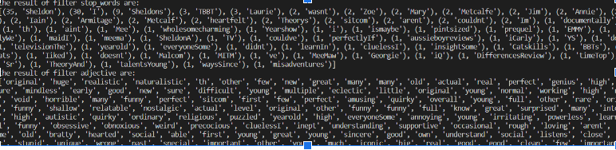

# Text-Analysis-Project
 
 **1. Project Overview** 
This project is intended to help an IMDB user to do some initial text analysis on the movie reviews of the movie they would like to search, which would provide the user a general idea of some shared characteristics of the movie reviews. The entire process of the text analysis project has been separated into three different parts: selecting text, cleaning and computing summary statistics, advanced text analysis including NLP(natural language process), text similarity, and clustering.

 **2. Part I:Text Selection** 
The first two parts of the project went smoothly except we are using the package Cinemagoer instead of the API of IMDB for the project, which would only provide the IMDB reviews on the first page. Therefore The limited size of the data sample and functionality of Cinemagoer would not make me to access all of the reviews on IMDB and do a random selection which is a pity in the project. Instead, after discussing with Professor Li we decided to use all of the reviews that Cinemagoer could provide to do the texture analysis. [part1:text_analysis]

 
 **3. Part II: Text cleaning and summrization** 
In part 2, I chose to separate the words from the review into a list and count on the total number of words and frequency of words. Also, during this process, since some of the words include different punctuation such as ^\w\s, I decided to import a re-library with the help of chat gpt to clean them out from the list. Furthermore, while we were counting the frequency of the word, we chose to use a dictionary format to show the result but there were too many meaningless or conjunction words included, we imported another file stopwords.txt from the OIM3640 repository to exclude the word inside the dictionary using for loop. Lastly, I tried to use the tools in the nltk library with the assistance of chatgpt to filter out other types of words but adjectives. [part two]

The result of part 2 shows that in all 24 reviews, we have found a total of 1705 words. Before we clean the stop words, we find out that “ the 78, and 52, is 48” are the top three words that counted the most. After we clean the stop words, we find out (35, 'Sheldon'), (30, 'I'), (9, 'Sheldons'), (3, 'TBBT'), (3, 'Laurie'), are the common character name in the front of the list, because, in the stopword list, it has contained plenty of adjectives and verbs. Also, I have manipulated the stop_word.txt by adding a, is the, and in there to help us filter out these meaningless conjunction words among sentences. The results of filtering out the stopword_txt are pretty successful. On the other hand, I was also thinking about the possibility of showing adjectives only from the reviews. Because the adjectives would be more related to the feeling of the reviewer toward the show. So under the assistance of chatgpt, I chose to use another package from nltk to filter the adjective only. The results of which are also surprisingly successful here are some adjectives left for the review of Young Sheldon such as original', 'huge', 'realistic', 'naturalistic 'funny', 'perfect 'hearted”.( The output and assistance process of chatgpt are posted below)

 **4. Part III: Advanced Texture Analysis** 
Going to the last part of the project, I have applied some advanced language packages and models to further research on texture analysis. For example, firstly I am using Natural Language processing using the NLTK package and for loop to give a score for the movie reviews posted by different audiences. The NLP will give three scores from different feelings negative, neutral, and positive. The closer to one meaning the stronger the feeling of that emotion would be. The results of the Young Sheldon review are mainly showing a  strong positive and neutral score meaning people still somehow recommend the show to others or introduce the content in the show. Only a few Lower scores mean people are not disliking the show or point out the problem or negative side of the show.

Besides the NLP process, I have also done a text similarity test by using the fuzzy package to input a sentence to find out the similarity between the input sentence and the reviews on IMDB. The more the sentence is closing to 100 the more similar the sentence would be close to the input sentence. In my project, since there is not a typical review of the Young Sheldon show, I chose to select one of the reviews from the 24 reviews we have and let it find out the similarity score above different numbers to see if there are any other reviews similar to this one or could we find exactly the same review. When the score sets above 99, it shows only the same sentence that we input. However, when we set the score large or equal to 40,it shows two reviews which are number 9 and 14 that is somehow similar to the one that we put in.

Lastly, I have done text clustering for all 24 of the reviews by plotting all of them on the plot to see if there are any coordinates or reviews that are close to each other. Unfortunately, the plot below shows the result of the clustering process seems statistically insignificant. It shows a nonlinear relationship and the coordinates on the plot have no correlation.

 **5. Part IV: Reflection** 

 In conclusion, the process of doing the texture analysis went smoothly. The topic I picked did have some limitations because the api from Cinemagoer could not capture all of the reviews from IMDB, which limit the sample size of the texture analysis. However, from my perspective, I still have a strong interest in doing the texture analysis of movie reviews. Analyzing the similarity between different people’s opinions is a hard job and the result of my project has proven the fact. The second primary goal of my project is to capture the key words from randomly selected reviews on IMDB. If the api could capture all of the reviews from the IMDB website, the first goal would be able to be achieved. The secondary goal is to do the natural language processing and analyze the similarity and clustering. Although the result of the clustering showed there were non-significant relationships among reviews, I guess if I had enough sample size there would be some potential relationship among them.

Chatgpt served as a good instructor helping me go through the process. I did not use it quite often as a debug tool because most of the process we have already did from previous exercises. But I have studied and used new methods learning from chatgpt to do the adjective filter and some debugging from the program I wrote.Overall, I found this is a very interesting project as I go through the texture analysis part by part. I am satisfied with the result and what I have learned from this first texture analysis project

